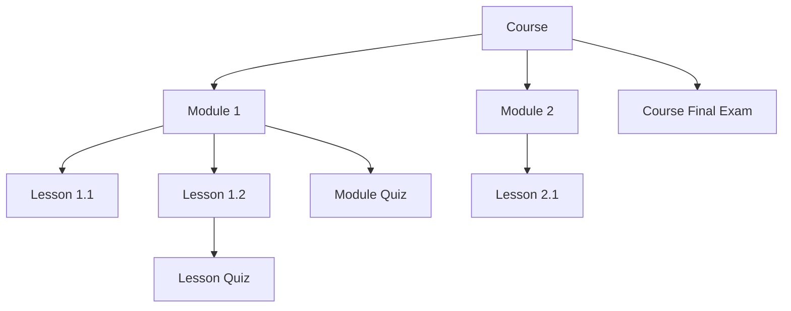
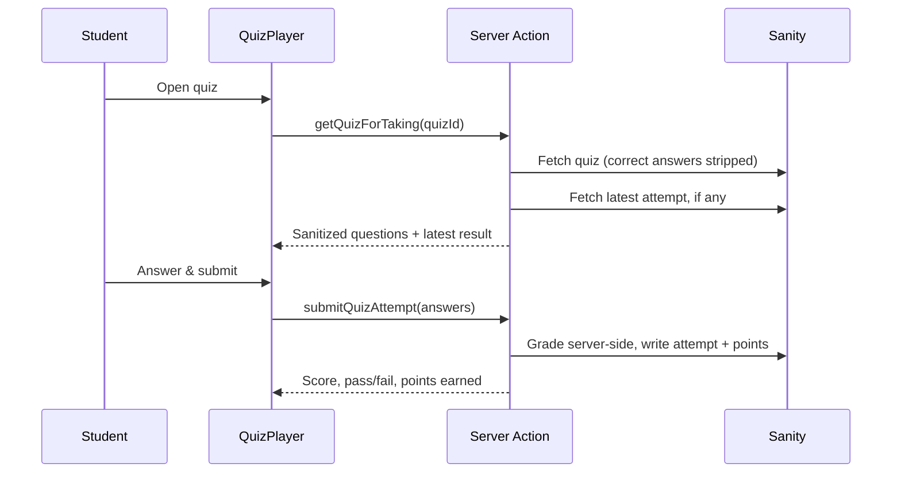
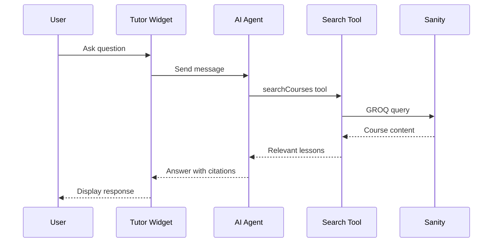

# Wellspring's Academy

[](https://creativecommons.org/licenses/by-nc/4.0/)
[](https://nextjs.org/)
[](https://react.dev/)
[](https://www.sanity.io/)
[](https://clerk.com/)
[](https://www.mux.com/)
[](https://openai.com/)
[](https://tailwindcss.com/)

An AI-powered Learning Management System: video courses organized into modules and lessons, gamified quizzes, an AI tutor, tiered subscriptions, and a Parent Portal for guardians to follow a learner's progress.

---

## What This App Is

Wellspring's Academy is a platform where:

- **Creators** upload and organize video courses through a custom admin panel
- **Learners** watch lessons, take quizzes, earn points, and get AI-powered help
- **Parents/guardians** link to a learner's account to follow their quiz scores, points, and course progress
- **Admins** manage all content through a bespoke dashboard built on the Sanity App SDK

### Key Concepts

| Concept | What It Means |
|---------|----------------|
| **Course** | A collection of modules on a topic |
| **Module** | A chapter within a course, made up of lessons (and optionally a module quiz) |
| **Lesson** | An individual video + notes (and optionally a lesson quiz) |
| **Quiz** | A set of questions attached to a lesson, module, or course (final exam) |
| **Tier** | Access level: Free, Pro ($), or Ultra ($$) |
| **Points** | Earned by passing a quiz (first attempt only); shown on the student dashboard |
| **AI Tutor** | Chat assistant (Ultra only) that searches course content to answer questions |
| **Parent Portal** | Any account can link to another as a "parent" to view that account's progress |

---

## Features

### For Learners

| Feature | Free | Pro | Ultra |
|---------|:----:|:---:|:-----:|
| Access to foundational courses | ✅ | ✅ | ✅ |
| Basic projects & exercises | ✅ | ✅ | ✅ |
| Quizzes, points & progress tracking | ✅ | ✅ | ✅ |
| All Pro-tier courses | ❌ | ✅ | ✅ |
| Advanced real-world projects | ❌ | ✅ | ✅ |
| Priority support | ❌ | ✅ | ✅ |
| **🤖 AI Learning Assistant** | ❌ | ❌ | ✅ |
| Exclusive Ultra-only content | ❌ | ❌ | ✅ |
| Early access to new courses | ❌ | ❌ | ✅ |

### Quizzes & Gamification

- Five question types, mixable within a single quiz: multiple choice, select-all-that-apply, fill-in-the-blank, ordering, and matching
- Quizzes attach to a lesson, a module (review), or a course (final exam)
- Server-side grading only — correct answers are never sent to the client
- Points are awarded once per quiz (first attempt), preventing point-farming via retakes
- Quizzes appear as real entries in the course/lesson outline, alongside lessons
- Sequential progression within a module — each item (lesson or quiz) unlocks only once the previous one is completed, enforced server-side

### Parent Portal

- Any signed-in account can invite another account (by email) to follow its progress — this is additive, not a separate account type, so a parent can also be a learner themself
- Invited accounts see the request in-app ("Your Parents") with Approve/Deny, in addition to a transactional email
- Parents get notified by email when a child approves or declines
- Parents can view a linked child's course progress, quiz history, and points balance, and remove the link at any time

### For Admins

- **Custom Admin Panel** (`/admin`) built with the Sanity App SDK — course, module, lesson, category, and quiz editors, all with live document editing (no separate save step)
- **Quiz builder** — drag-reorderable question list supporting all five question types, with a one-click shortcut to create a quiz pre-attached to the lesson/module/course you're editing
- **Sanity Studio** (`/studio`) as a full-featured fallback for anything the custom panel doesn't cover

### AI Learning Assistant

- Powered by **GPT-4o** via the Vercel AI SDK, gated to Ultra subscribers
- Tool-calling agent that searches course titles, descriptions, and lesson content to answer questions and recommend lessons
- Never answers from outside the course catalog — no hallucinated content

### Video & Auth

- **Mux** for video hosting, signed playback tokens, and adaptive bitrate streaming
- **Clerk** for authentication and tiered subscription billing

---

## Tech Stack

| Layer | Technology |
|-------|------------|
| Framework | Next.js 16 (App Router), React 19 |
| Language | TypeScript, end-to-end typed via Sanity typegen |
| CMS / Database | Sanity (custom App SDK admin panel + Studio) |
| Auth & Billing | Clerk |
| Video | Mux |
| AI | OpenAI GPT-4o via Vercel AI SDK |
| Email | Brevo (transactional email for parent invites) |
| Styling | Tailwind CSS 4, Shadcn UI |
| Drag & drop | dnd-kit |
| Linting/formatting | Biome |

---

## Getting Started

### Prerequisites

- **Node.js 18+**
- **pnpm**
- Accounts: Sanity, Clerk, Mux, OpenAI, Brevo

### Installation

```bash
# Clone the repository
git clone <your-repo-url>
cd wellspring-online

# Install dependencies
pnpm install

# Copy environment variables and fill them in (see below)
cp .env.example .env.local

# Run the dev server
pnpm dev
```

- Main app: [http://localhost:3000](http://localhost:3000)
- Admin panel: [http://localhost:3000/admin](http://localhost:3000/admin)
- Sanity Studio: [http://localhost:3000/studio](http://localhost:3000/studio)

### Environment Variables

```bash
# App
NEXT_PUBLIC_APP_URL=http://localhost:3000

# Sanity
NEXT_PUBLIC_SANITY_PROJECT_ID=your_project_id
NEXT_PUBLIC_SANITY_DATASET=production
NEXT_PUBLIC_SANITY_API_VERSION=2025-11-27
NEXT_PUBLIC_SANITY_ORG_ID=your_org_id
SANITY_API_READ_TOKEN=your_read_token
SANITY_API_WRITE_TOKEN=your_write_token

# Clerk Authentication
NEXT_PUBLIC_CLERK_PUBLISHABLE_KEY=pk_test_...
CLERK_SECRET_KEY=sk_test_...

# OpenAI (AI Tutor, Ultra tier only)
OPENAI_API_KEY=sk-...

# Mux Video
MUX_TOKEN_ID=your_mux_token_id
MUX_TOKEN_SECRET=your_mux_token_secret
MUX_SIGNING_KEY_ID=your_signing_key_id
MUX_SIGNING_KEY_PRIVATE=your_signing_key_private

# Brevo (transactional email for Parent Portal invites)
BREVO_API_KEY=your_brevo_api_key
BREVO_SENDER_EMAIL=you@yourdomain.com   # must be a verified sender in Brevo
BREVO_SENDER_NAME=Wellspring's Academy   # optional
```

> ⚠️ **Security notes:** Never commit `.env.local`. Variables starting with `NEXT_PUBLIC_` are exposed to the browser — keep every other key (Clerk secret, Mux signing key, Sanity write token, Brevo key) strictly server-side.

### First-Time Setup Checklist

- [ ] Create a Sanity project and dataset
- [ ] Set up a Clerk application with pricing plans (Free, Pro, Ultra)
- [ ] Create a Mux account, get API tokens and a signing key pair
- [ ] Add an OpenAI API key
- [ ] Create a Brevo account, verify a sender email/domain, add its API key
- [ ] Run `pnpm dev` and confirm all pages load
- [ ] Create your first course, module, lesson, and quiz via `/admin`

---

## Architecture

### `/admin` vs `/studio`

| Route | Technology | Purpose |
|-------|------------|---------|
| `/admin` | **Sanity App SDK** | The bespoke, purpose-built CMS frontend learners' course creators actually use |
| `/studio` | **Sanity Studio** | Full-featured fallback for content types or operations the custom panel doesn't cover |

The `/admin` panel is built directly on the Sanity App SDK's live-document hooks (`useDocument`, `useEditDocument`, `useDocuments`, `useQuery`, `useApplyDocumentActions`) — every field edit patches the document in real time, and "Publish"/"Discard" are explicit actions rather than a form submit.

### Content Hierarchy



### Quiz Grading Flow



### AI Tutor Flow



---

## Database Schema Overview

| Type | Description |
|------|-------------|
| `course` | Top-level container: title, slug, tier, modules[], featured |
| `module` | Groups lessons: title, description, lessons[], completedBy[] |
| `lesson` | Video + notes: title, slug, video, content (Portable Text), completedBy[] |
| `category` | Organizes courses |
| `quiz` | Attaches to a lesson, module, or course; questions[], passingScorePercent, completedBy[] |
| `multipleChoiceQuestion` / `selectAllQuestion` / `fillInQuestion` / `orderingQuestion` / `matchingQuestion` | The five question object types used inside `quiz.questions[]` |
| `quizAttempt` | One per submission: student, quiz ref, graded answers, score, points awarded |
| `pointsTransaction` | Ledger entry (+/-) per student; sums to their points balance |
| `parentLink` | Links a parent account to a child account by email, with pending/accepted status |
| `note` | User notes (demo feature) |

### Design Decisions

1. **References over embedding** — modules and lessons are separate documents referenced by courses, so content can be reused across courses.
2. **Completion tracked as arrays of user IDs** — stored directly on `course`/`module`/`lesson`/`quiz` documents (`completedBy[]`) rather than a separate progress collection, for simplicity.
3. **Tier lives on the course** — all lessons and quizzes in a course inherit its access tier.
4. **Quiz grading never trusts the client** — correct answers are stripped before a quiz is sent to the browser; grading happens entirely server-side against the authoritative document.
5. **Points are a ledger, not a mutable counter** — each earn/spend is its own `pointsTransaction`, and the balance is the sum, which keeps the history auditable and makes a future redemption/spend feature a non-breaking addition.

---

## Deployment

### Deploy to Vercel

```bash
pnpm i -g vercel
vercel        # preview deploy
vercel --prod # production deploy
```

Or connect the repository via the Vercel dashboard and add the environment variables listed above.

### Post-Deployment Checklist

- [ ] All environment variables set in Vercel (including `BREVO_SENDER_EMAIL`)
- [ ] Authentication flow works (sign up, sign in, sign out)
- [ ] Subscription/upgrade flow works
- [ ] Video playback works
- [ ] AI tutor works (Ultra accounts only)
- [ ] Parent invite email sends and the accept link works
- [ ] Sanity CORS configured for the production domain

---

## Common Issues & Solutions

| Area | Problem | Solution |
|------|---------|----------|
| Auth | "Clerk not loading" | Check `NEXT_PUBLIC_CLERK_PUBLISHABLE_KEY` |
| Auth | Subscription not recognized | Verify Clerk billing/webhook configuration |
| Video | Videos not playing | Verify Mux credentials and that the asset status is "ready" |
| Video | "Playback token invalid" | Check `MUX_SIGNING_KEY_PRIVATE` formatting |
| Sanity | TypeScript errors after a schema change | Run `pnpm types:generate` |
| Sanity | Schema changes not appearing | Restart the dev server |
| AI Tutor | Not responding | Verify `OPENAI_API_KEY` is valid |
| AI Tutor | Showing for non-Ultra users | Check the Clerk plan check in `app/api/chat/route.ts` |
| Parent invites | Email never arrives | Verify `BREVO_SENDER_EMAIL` is a **verified** sender in your Brevo account — invites still get created even if the email send fails |

---

## License

This project is licensed under the **Creative Commons Attribution-NonCommercial 4.0 International License** — see [LICENSE.md](LICENSE.md) for the full text and attribution requirements.

---

## Quick Reference

### Useful Commands

```bash
pnpm dev              # Start dev server
pnpm build            # Production build
pnpm start            # Start production server

pnpm types:generate   # Extract Sanity schema + generate TypeScript types
pnpm typecheck        # Check TypeScript

pnpm lint             # Run Biome linter
pnpm format           # Format with Biome
```

### Key Files & Folders

```
├── app/
│   ├── (admin)/admin/     # Custom admin panel (Sanity App SDK)
│   ├── (app)/             # Learner-facing app, incl. /parent (Parent Portal) and /quizzes
│   ├── studio/             # Sanity Studio
│   └── api/                # API routes (AI chat)
├── components/
│   ├── admin/              # Admin components & editors
│   ├── courses/ lessons/   # Course & lesson display components
│   ├── quiz/                # Quiz-taking UI
│   ├── parent/              # Parent Portal UI
│   ├── tutor/                # AI tutor widget
│   └── ui/                   # Shadcn components
├── lib/
│   ├── actions/             # Server actions (courses, lessons, quizzes, parent)
│   ├── ai/                   # AI agent & tools
│   ├── email/                 # Brevo transactional email
│   └── module-items.ts        # Shared lesson/quiz outline + sequential-locking logic
├── sanity/
│   ├── schemaTypes/          # Sanity schema definitions
│   └── lib/                   # Sanity client & GROQ queries
└── sanity.config.ts            # Sanity Studio config
```

### Important Concepts

| Concept | File(s) | Description |
|---------|---------|--------------|
| Sanity App SDK Provider | `components/SanityAppProvider.tsx` | Wraps the app in Sanity SDK context (used by `/admin`) |
| Tier Access Control | `lib/course-access.ts` | Checks a user's subscription tier |
| Quiz Grading | `lib/actions/quizzes.ts` | Server-side-only grading, points ledger, sequential lock checks |
| Outline & Locking | `lib/module-items.ts` | Builds the ordered lesson+quiz outline and unlock state per module |
| AI Tutor Agent | `lib/ai/tutor-agent.ts` | GPT-4o agent with a course-search tool |
| Parent Portal | `lib/actions/parent.ts` | Invite, approve/deny, and progress-viewing logic |
| Document Actions | `components/admin/documents/DocumentActions.tsx` | Publish/unpublish/discard/delete logic in the admin panel |
